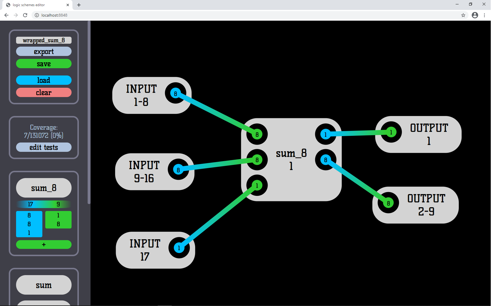
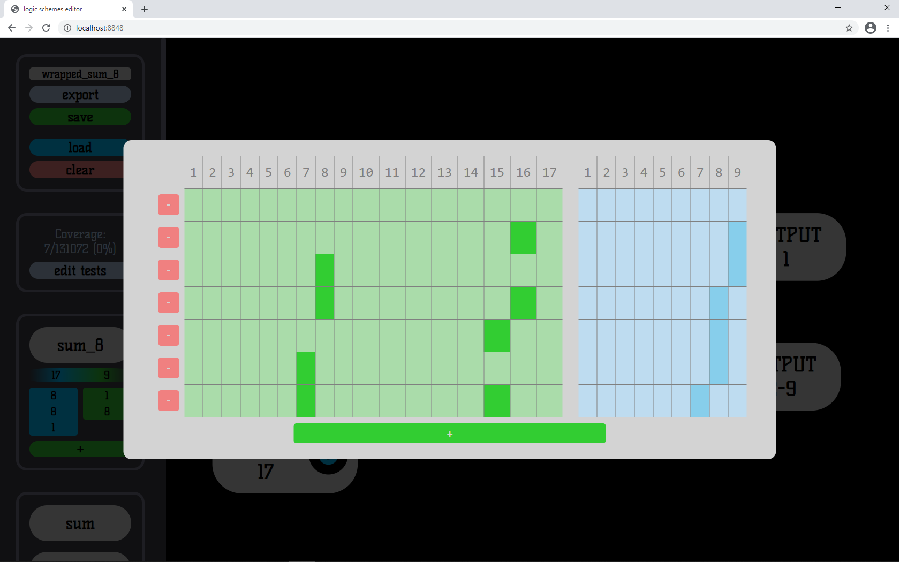

# Logic schemes editor

## Features

* Easy blocks and wires adding (left mouse button)

* Blocks and wires removing (right mouse button on block or input/output)

* Custom blocks creating

* Custom blocks inputs/outputs grouping

  

* Workspace dragging and scaling (mouse wheel)

* Saving / loading schemes

* Easily adding and editing tests

  

* Exporting schemes to format compatible with [compiler](https://github.com/MentalBlood/logic_schemes_compiler)

## Usage

Clone / download repository and open index.html in web browser (Chrome is recommended)